---
## Front matter
title: "Внешний курс. Раздел 1"
subtitle: "Основы информационной безопасности"
author: "Малюга Валерия Васильевна"

## Generic otions
lang: ru-RU
toc-title: "Содержание"

## Bibliography
bibliography: bib/cite.bib
csl: pandoc/csl/gost-r-7-0-5-2008-numeric.csl

## Pdf output format
toc: true # Table of contents
toc-depth: 2
lof: true # List of figures
lot: true # List of tables
fontsize: 12pt
linestretch: 1.5
papersize: a4
documentclass: scrreprt
## I18n polyglossia
polyglossia-lang:
  name: russian
  options:
	- spelling=modern
	- babelshorthands=true
polyglossia-otherlangs:
  name: english
## I18n babel
babel-lang: russian
babel-otherlangs: english
## Fonts
mainfont: PT Serif
romanfont: PT Serif
sansfont: PT Sans
monofont: PT Mono
mainfontoptions: Ligatures=TeX
romanfontoptions: Ligatures=TeX
sansfontoptions: Ligatures=TeX,Scale=MatchLowercase
monofontoptions: Scale=MatchLowercase,Scale=0.9
## Biblatex
biblatex: true
biblio-style: "gost-numeric"
biblatexoptions:
  - parentracker=true
  - backend=biber
  - hyperref=auto
  - language=auto
  - autolang=other*
  - citestyle=gost-numeric
## Pandoc-crossref LaTeX customization
figureTitle: "Рис."
tableTitle: "Таблица"
listingTitle: "Листинг"
lofTitle: "Список иллюстраций"
lotTitle: "Список таблиц"
lolTitle: "Листинги"
## Misc options
indent: true
header-includes:
  - \usepackage{indentfirst}
  - \usepackage{float} # keep figures where there are in the text
  - \floatplacement{figure}{H} # keep figures where there are in the text
---

# Цель работы

Выполнение контрольных заданий первого блока внешнего курса "Основы Кибербезопасности"

# Выполнение заданий блока "Основы Кибербезопасности"

## Как работает интернет: базовые сетевые протоколы

UDP - протокол сетевого уровня 
TCP - протокол транспортного уровня
HTTPS - протокол прикладного уровня
IP - протокол сетевого уровня,
поэтому ответ HTTPS (рис. [-@fig:001]).

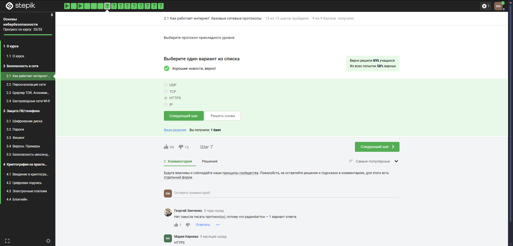{#fig:001 width=70%}

Ранее было упомянуто, что протокол TCP - transmission control protocol - работает на транспортном уровне (рис. [-@fig:002]).

{#fig:002 width=70%}

В адресе типа IPv4 не может быть чисел больше 255, поэтому первые два варианта не подходят (рис. [-@fig:003]).

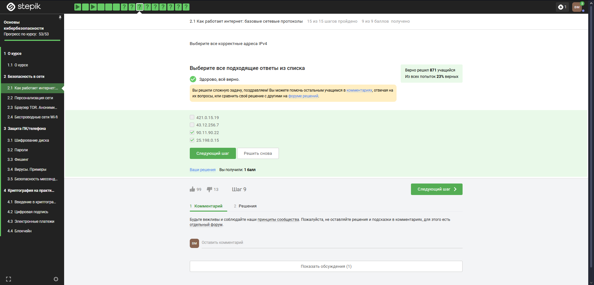{#fig:003 width=70%}

DNS-сервер, Domain name server — приложение, предназначенное для ответов на DNS-запросы по соответствующему протоколу Обязательное условие – Сопоставление сервером доменных имен доменного имени с IP-адресом называется разрешением имени и адреса (рис. [-@fig:004]).

{#fig:004 width=70%}

Распределение протоколов в модели TCP/IP:

- Прикладной уровень (Application Layer): HTTP, RTSP, FTP, DNS.

- Транспортный уровень (Transport Layer): TCP, UDP, SCTP, DCCP.

- Сетевой (Межсетевой) уровень (Network Layer): IP.

- Уровень сетевого доступа (Канальный) (Link Layer): Ethernet, IEEE 802.11, WLAN, SLIP, Token Ring, ATM и MPLS.
(рис. [-@fig:005]).

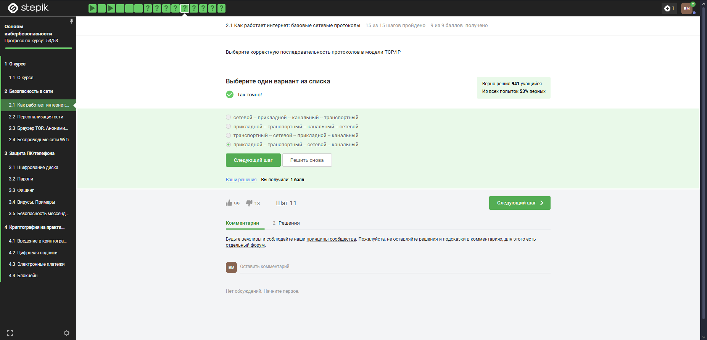{#fig:005 width=70%}

Протокол http передает не зашифрованные данные, а протокол https уже будет передавать зашифрованные данные (рис. [-@fig:006]).

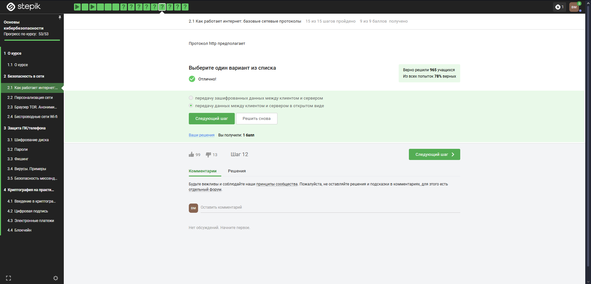{#fig:006 width=70%}

https передает зашифрованные данные, одна из фаз - передача данных, другая должна быть рукопожатием (рис. [-@fig:007]).

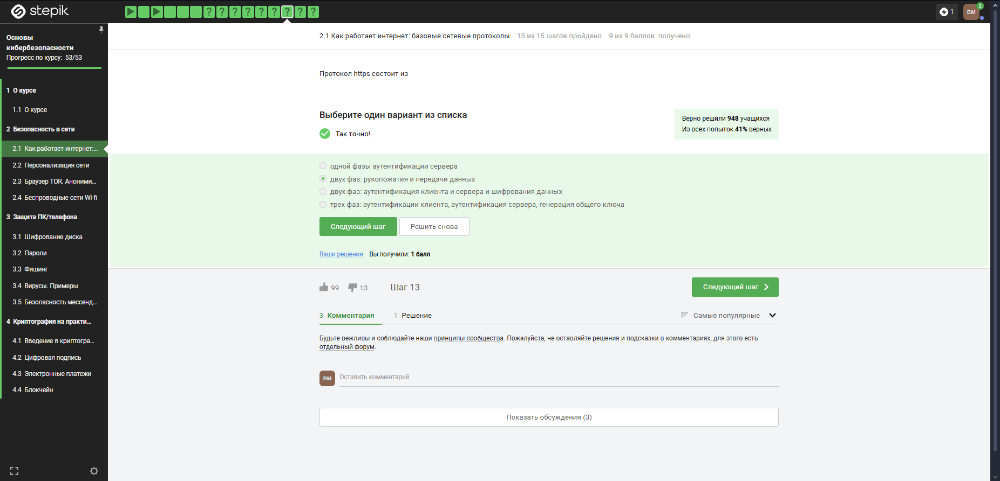{#fig:007 width=70%}

TLS определяется и клиентом, и сервером, чтобы было возможно подключиться (рис. [-@fig:008]).

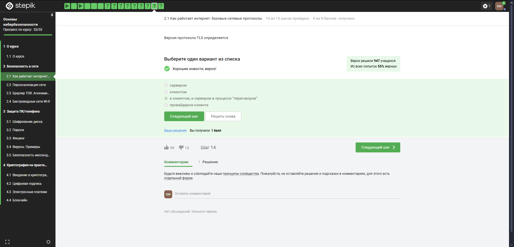{#fig:008 width=70%}

Ответ на изобрадении, остальные варианты в протоколе предусмотрены (рис. [-@fig:009]).

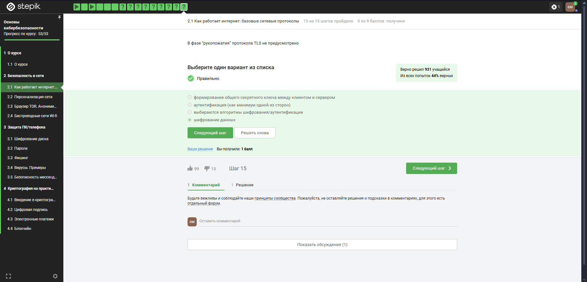{#fig:009 width=70%}

## Персонализация сети

Куки точно не хранят пароли и IP-адреса, а id ceccии и идентификатор хранят (рис. [-@fig:010]).

{#fig:010 width=70%}

Конечно же, куки не делают соединение более надежным (рис. [-@fig:011]).

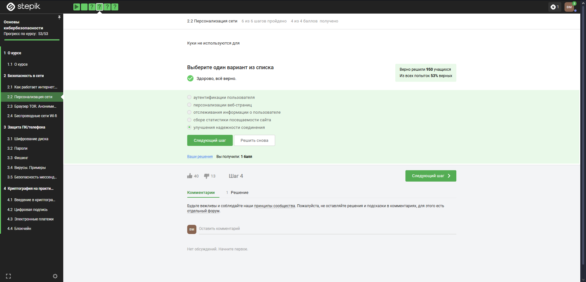{#fig:011 width=70%}

Ответ на изображении (рис. [-@fig:012]).

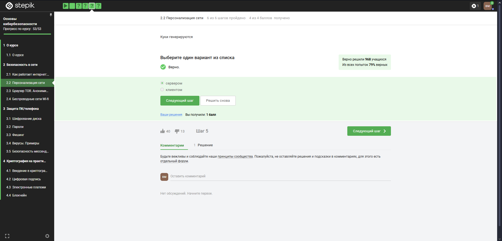{#fig:012 width=70%}

Сессионные куки хранятся в течение сессии, то есть пока используется веб-сайт (рис. [-@fig:013]).

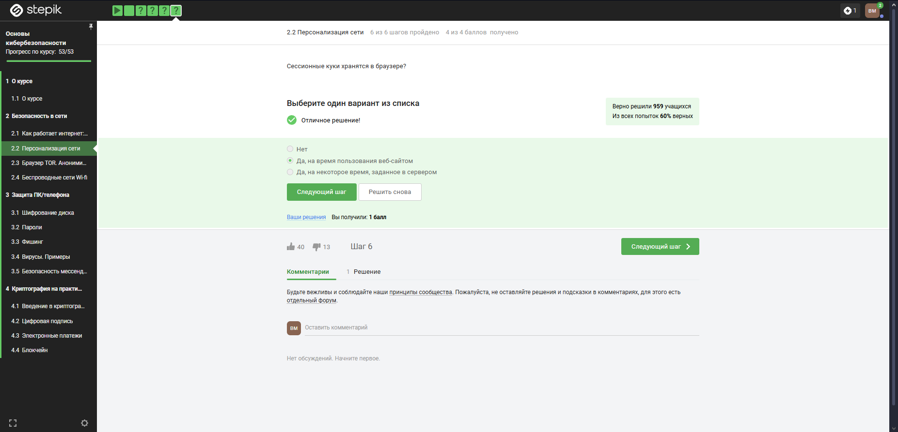{#fig:013 width=70%}

## Браузер TOR. Анонимизация

Необходимо три узла - входной, промежуточный и выходной (рис. [-@fig:014]).

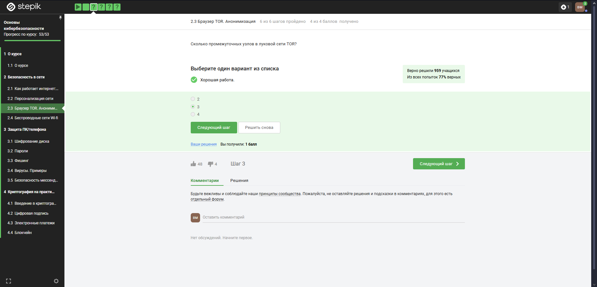{#fig:014 width=70%}

IP-адрес не должен быть известен охранному и промежуточному узлам (рис. [-@fig:015]).

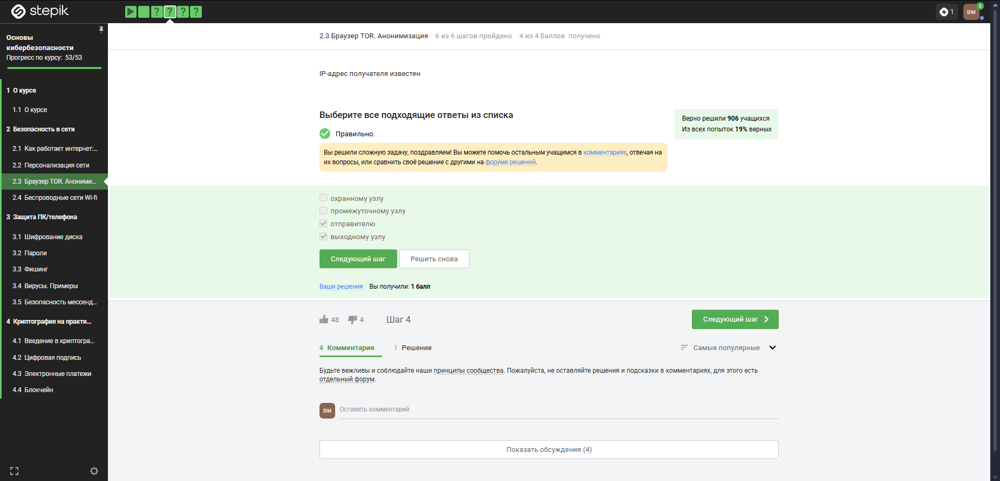{#fig:015 width=70%}

Отправитель генерирует общий секретный ключ со узлами, через которые идет передача, то есть со всеми (рис. [-@fig:016]).

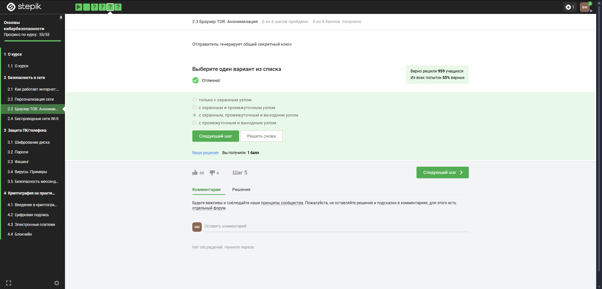{#fig:016 width=70%}

Для получаения пакетов не нужно использовать TOR. TOR — это технология, которая позволяет с некоторым успехом скрыть личность человека в интернете (рис. [-@fig:017]).

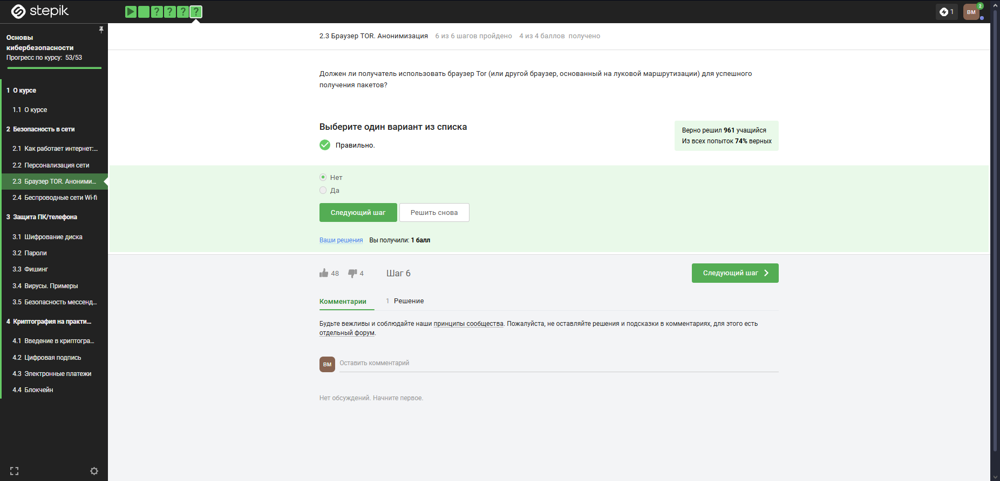{#fig:017 width=70%}

## Беспроводные сети Wi-fi

Действительно, это определение Wi-Fi (рис. [-@fig:018]).

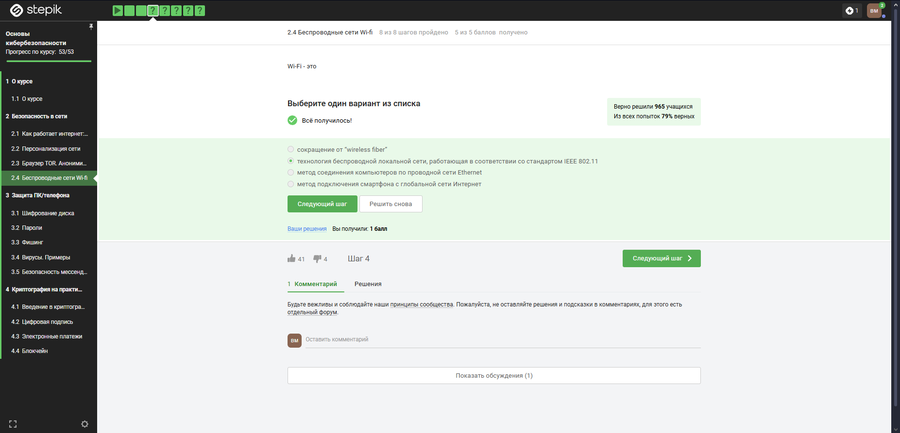{#fig:018 width=70%}

Для целей работы в Интернете Wi-Fi обычно располагается как канальный уровень (эквивалентный физическому и канальному уровням модели OSI) ниже интернет-уровня интернет-протокола. Это означает, что узлы имеют связанный интернет-адрес, и при подходящем подключении это обеспечивает полный доступ в Интернет. (рис. [-@fig:019]).

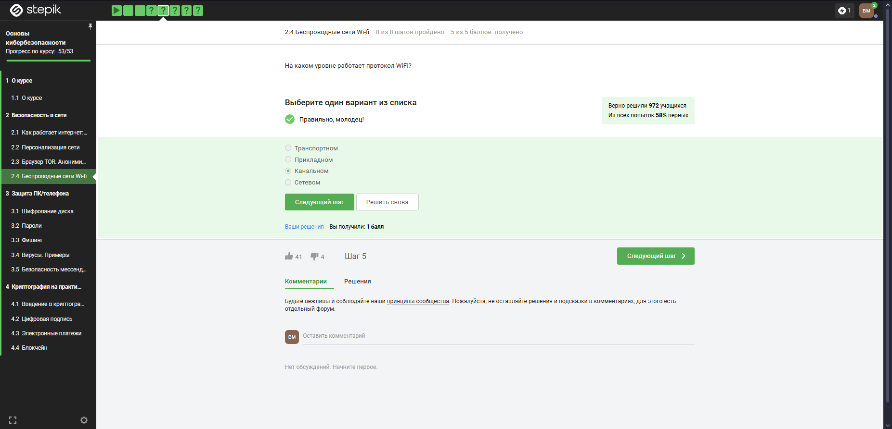{#fig:019 width=70%}

WEP (Wired Equivalent Privacy) – устаревший и небезопасный метод проверки подлинности. Это первый и не очень удачный метод защиты. Злоумышленники без проблем получают доступ к беспроводным сетям, которые защищены с помощью WEP, был заменен остальными представленными (рис. [-@fig:020]).

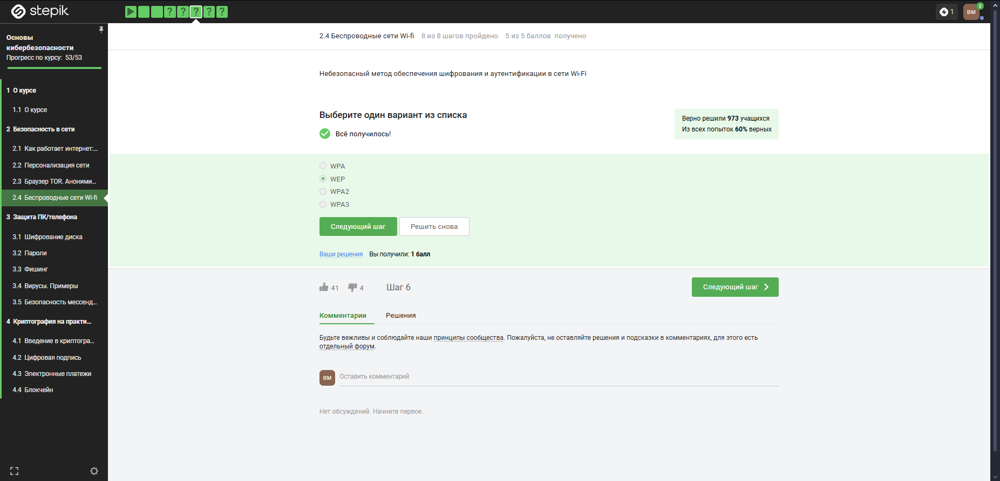{#fig:020 width=70%}

Нужно аутентифицировать устройства и позже передаются зашифрованные данные (рис. [-@fig:021]).

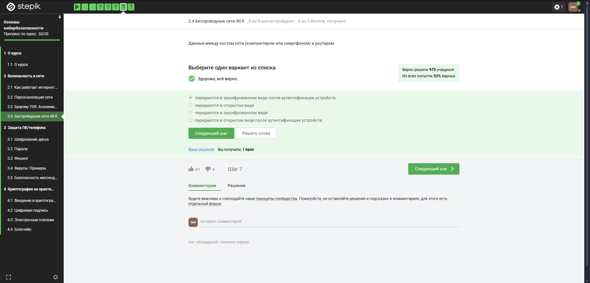{#fig:021 width=70%}

В целом, понятно по названию, что WPA2 Personal для личного использования, то есть для домашней сети, enterprise - для предпиятий (рис. [-@fig:022]).

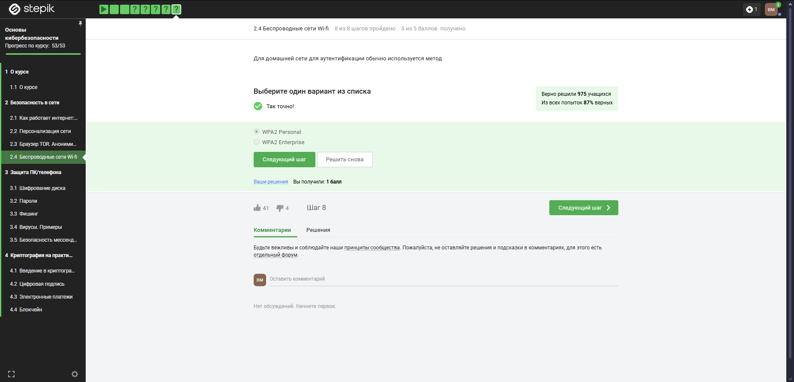{#fig:022 width=70%}

# Выводы

В ходе выполнения блока "Безопасность в сети" узнала о работе базовых сетевых протоколов, куки сетей Wi-Fi и браузера TOR.
