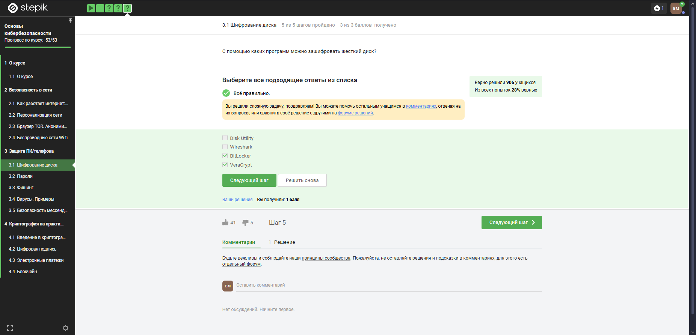

---
## Front matter
lang: ru-RU
title: Внешний курс. Раздел 2
subtitle: Основы информационной безопасности
author:
  - Малюга В. В.
institute:
  - Российский университет дружбы народов, Москва, Россия
date: 8 марта 2024

## i18n babel
babel-lang: russian
babel-otherlangs: english

## Formatting pdf
toc: false
toc-title: Содержание
slide_level: 2
aspectratio: 169
section-titles: true
theme: metropolis
header-includes:
 - \metroset{progressbar=frametitle,sectionpage=progressbar,numbering=fraction}
---

# Информация

## Докладчик

:::::::::::::: {.columns align=center}
::: {.column width="70%"}

  * Малюга Валерия Васильевна  
  * студентка группы НКАбд-04-23  
  * Российский университет дружбы народов  
  * <https://github.com/vvmalyuga>  

:::
::: {.column width="30%"}

:::
::::::::::::::

# Цель работы

## Цель

Пройти второй блок курса **"Основы кибербезопасности"**,  
а именно — изучить:

- шифрование данных на устройствах  
- принципы безопасного хранения паролей  
- методы фишинга  
- виды вредоносного ПО  
- сквозное шифрование в мессенджерах

# Защита ПК и телефона

## Шифрование диска

Шифрование диска — технология защиты информации,  
переводящая данные в нечитаемый код.  
Это не позволяет посторонним получить доступ к содержимому.

---

## Иллюстрация: шифрование диска

{#fig:001 width=70%}

---

## Тип шифрования

Шифрование часто основано на **симметричном методе**,  
когда для шифрования и дешифрования используется один и тот же ключ.

---

## Иллюстрация: симметричное шифрование

{#fig:002 width=70%}

---

## Программы шифрования

Примеры программ: BitLocker, FileVault, VeraCrypt и другие.  
Они позволяют настроить полное или частичное шифрование данных.

---

## Иллюстрация: программы для шифрования

{#fig:003 width=70%}

# Пароли

## Надежный пароль

Стойкий пароль — длинный, содержит специальные символы  
и не основан на личной информации. Его сложно подобрать.

---

## Иллюстрация: стойкость пароля

{#fig:004 width=70%}

---

## Надёжное хранение

Менеджеры паролей — единственный по-настоящему безопасный способ хранения.  
Другие методы (запись на бумаге, в блокноте и т.д.) ненадежны.

---

## Иллюстрация: ненадежные способы

{#fig:005 width=70%}

---

## CAPTCHA

Капча используется для определения,  
что перед устройством — человек, а не бот.

---

## Иллюстрация: капча

{#fig:006 width=70%}

---

## Хеширование паролей

Пароли не хранятся в открытом виде.  
Используются хеш-функции, которые необратимо шифруют данные.

---

## Иллюстрация: хеширование

{#fig:007 width=70%}

---

## Использование соли

Добавление соли в хеш-функции повышает безопасность.  
Однако это не единственная мера, необходима комплексная защита.

---

## Иллюстрация: соль

{#fig:008 width=70%}

---

## Комплексная защита

Все меры безопасности должны использоваться вместе:  
хеширование, соль, шифрование и менеджеры паролей.

---

## Иллюстрация: меры защиты

{#fig:009 width=70%}

# Фишинг

## Ссылки

Фишинговые ссылки подделываются под настоящие,  
но содержат небольшие отличия.

---

## Иллюстрация: фишинговые ссылки

{#fig:010 width=70%}

---

## От кого приходит фишинг

Фишинговое письмо может прийти даже от знакомого —  
если его аккаунт взломан.

---

## Иллюстрация: фишинг от знакомого

{#fig:011 width=70%}

# Вредоносное ПО

## Вирусы

Вирусы — это вредоносные программы,  
цель которых — нанести ущерб пользователю.

---

## Иллюстрация: вирус

{#fig:012 width=70%}

---

## Троян

Троян — вредоносная программа,  
маскирующаяся под легальное ПО.

---

## Иллюстрация: троян

{#fig:013 width=70%}

# Безопасность мессенджеров

## Обмен ключами

При первом сообщении между пользователями  
происходит обмен ключами шифрования.

---

## Иллюстрация: формирование ключа

{#fig:014 width=70%}

---

## Сквозное шифрование

Сообщения шифруются на стороне отправителя  
и расшифровываются только получателем.

---

## Иллюстрация: сквозное шифрование

{#fig:015 width=70%}

# Выводы

- Изучены методы шифрования и защиты устройств  
- Рассмотрены надежные способы хранения паролей 
