# Цель работы

## Цель

Пройти третий блок курса **«Основы кибербезопасности»**,  
освоить основы **криптографии на практике**.

# Криптография на практике

## Введение: Ассиметричное шифрование

Используется определение ассиметричного шифрования с двумя ключами:

{width=70%}

---

## Хэш-функции

Основные условия для криптографической хэш-функции:

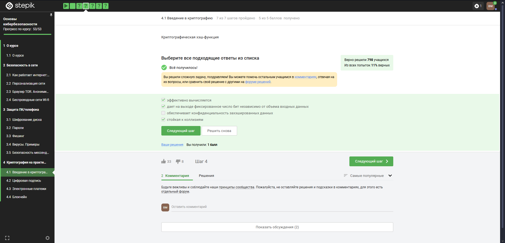{width=70%}

---

## Алгоритмы цифровой подписи

Отмечены алгоритмы цифровой подписи:

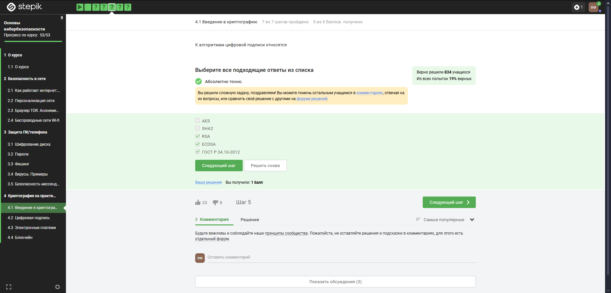{width=70%}

---

## Аутентификация сообщения

Аутентификация подтверждает целостность и источник данных:

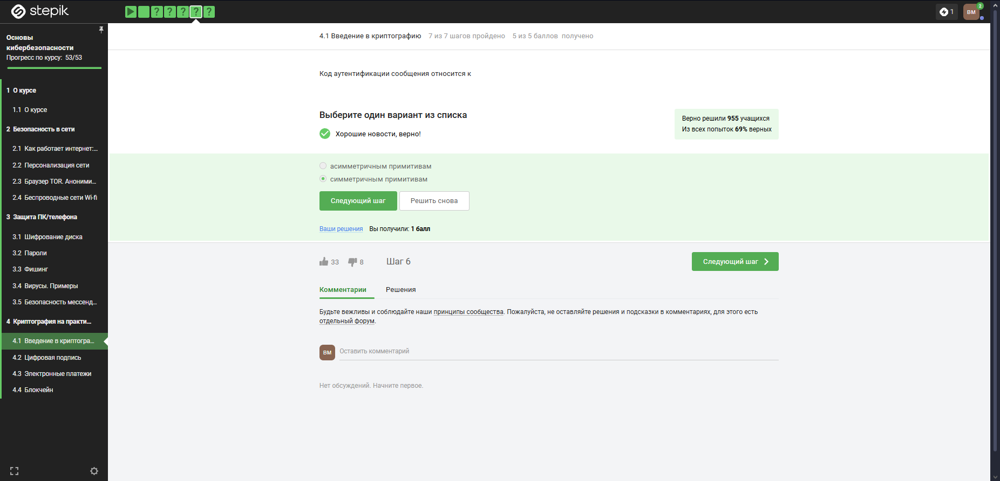{width=70%}

---

## Обмен ключами Диффи–Хэллмана

Определение и принцип работы обмена ключами:

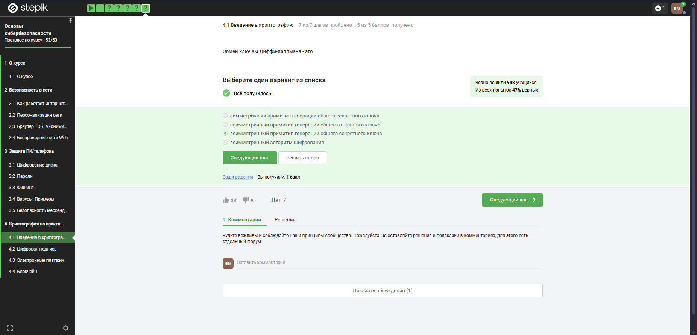{width=70%}

# Цифровая подпись

## Что такое ЭЦП

Протокол ЭЦП относится к протоколам с публичным ключом:

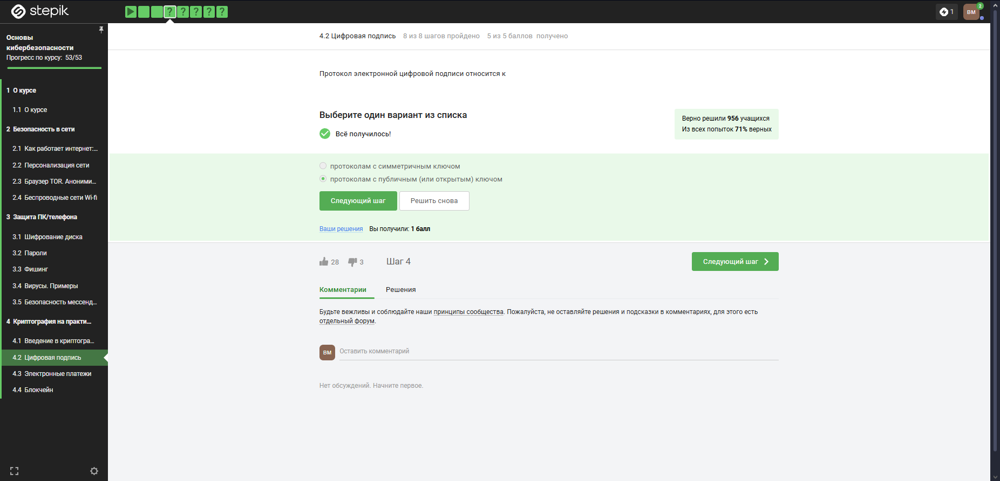{width=70%}

---

## Верификация ЭЦП

Алгоритм верификации:  
1. Хэширование документа  
2. Расшифровка подписи  
3. Сравнение хэшей

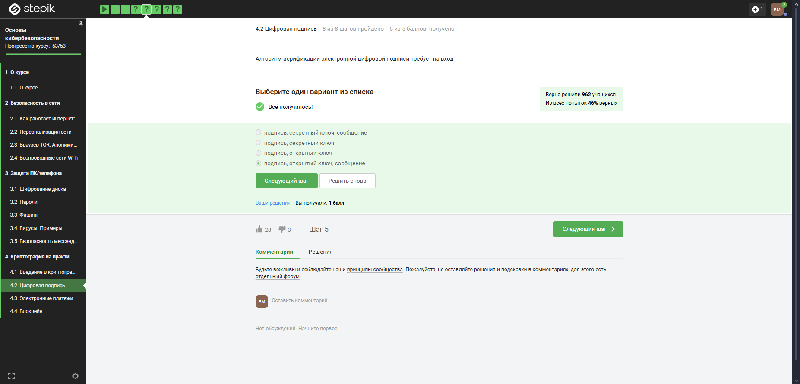{width=70%}

---

## Свойства ЭЦП

ЭЦП обеспечивает целостность, авторство, но не конфиденциальность:

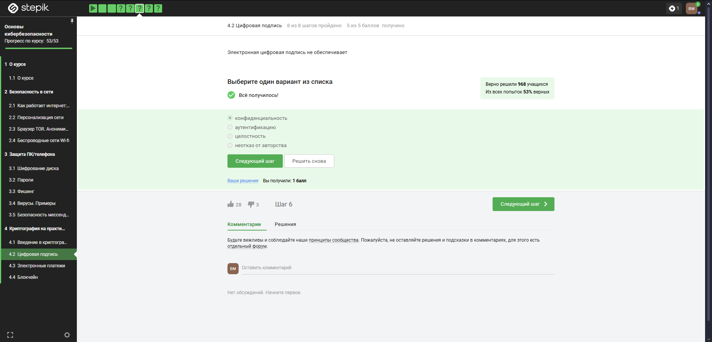{width=70%}

---

## Применение ЭЦП

Для отправки отчётности в ФНС используется усиленная квалифицированная ЭЦП:

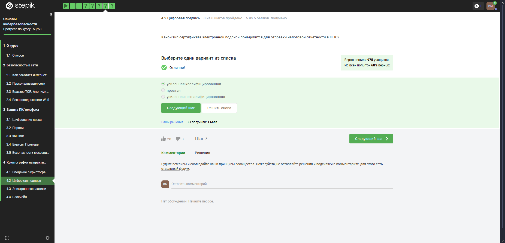{width=70%}

---

## Контрольный вопрос

Выбран верный ответ на тему ЭЦП:

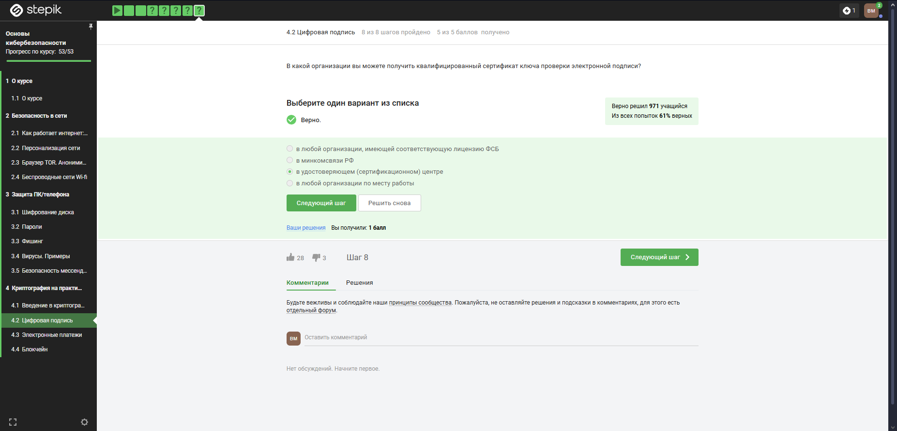{width=70%}

# Электронные платежи

## Платёжные системы

Примеры платёжных систем: Visa, MasterCard, МИР:

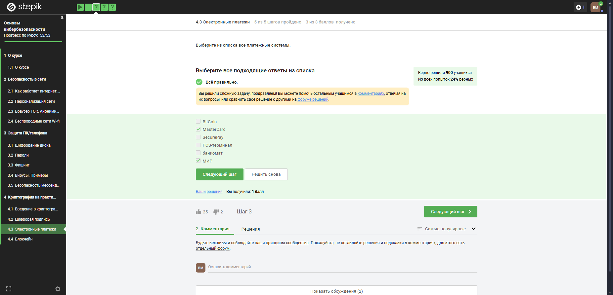{width=70%}

---

## Контрольный вопрос

Верный ответ по платёжным системам:

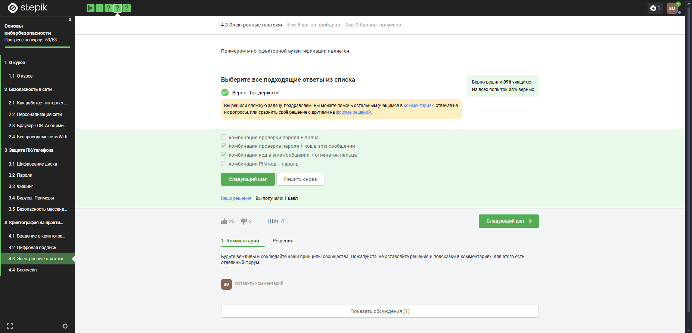{width=70%}

---

## Многофакторная аутентификация

Применяется при онлайн-платежах для защиты пользователя:

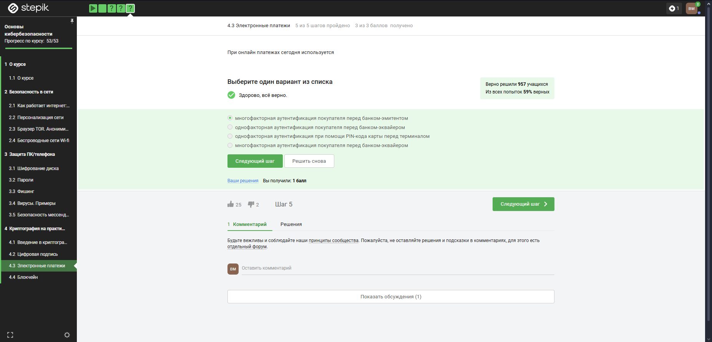{width=70%}

# Блокчейн

## Proof-of-Work

PoW — алгоритм консенсуса, обеспечивающий подтверждение транзакций:

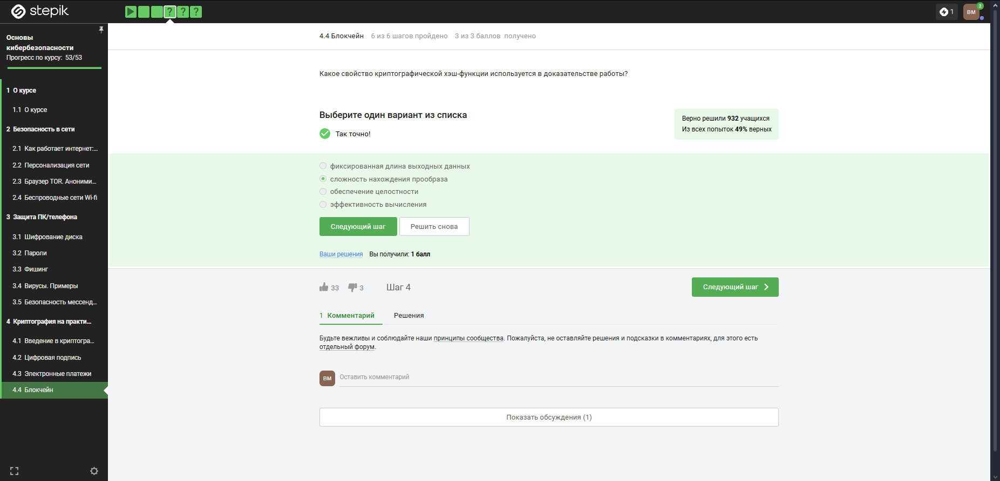{width=70%}

---

## Консенсус блокчейна

Консенсус — соглашение между участниками сети о состоянии данных:

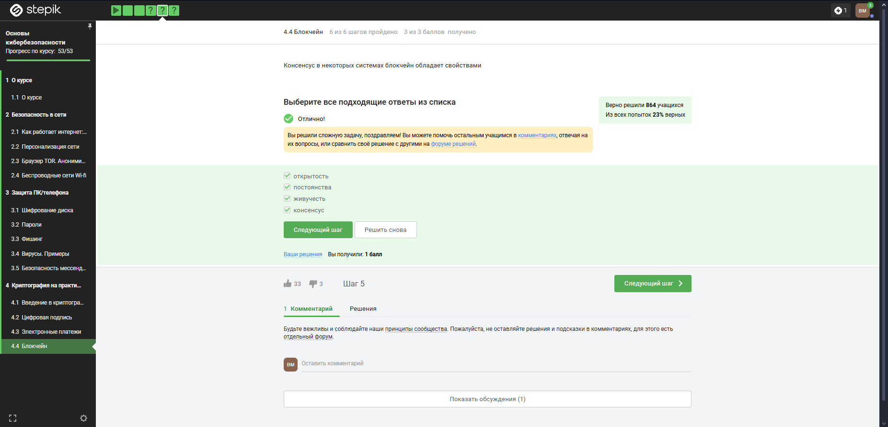{width=70%}

---

## Контрольный вопрос

Правильный ответ: используется цифровая подпись:

{width=70%}

# Выводы

- Изучены основы криптографии и цифровой подписи  
- Поняты принципы работы с ЭЦП и блокчейном  
- Освоены базовые методы защиты информации  

Блок 3 пройден. Внешний курс завершён.
