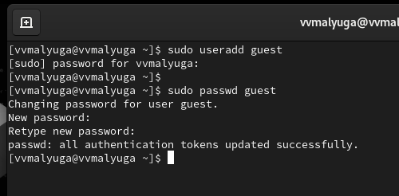
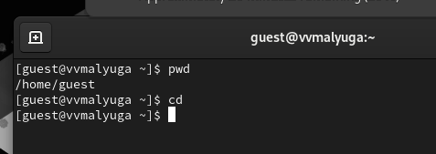
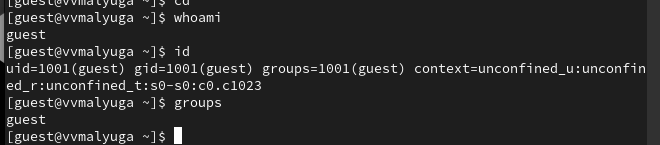
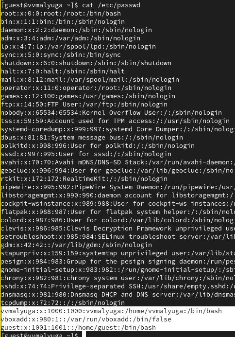
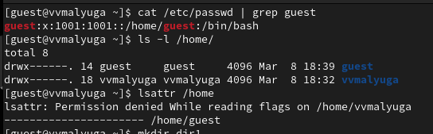
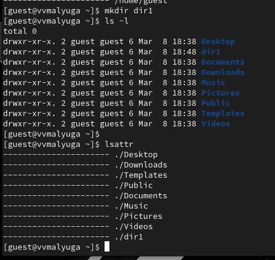
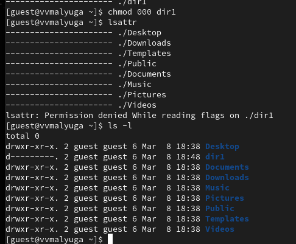
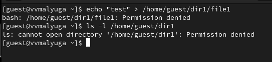

---
## Front matter
lang: ru-RU
title: Презентация по выполнению индивидуального проекта №1
subtitle: Основы информационной безопасности
author:
  - Малюга В. В.
institute:
  - Российский университет дружбы народов, Москва, Россия
date: 8 марта 2024

## i18n babel
babel-lang: russian
babel-otherlangs: english

## Formatting pdf
toc: false
toc-title: Содержание
slide_level: 2
aspectratio: 169
section-titles: true
theme: metropolis
header-includes:
 - \metroset{progressbar=frametitle,sectionpage=progressbar,numbering=fraction}
---

# Информация

## Докладчик

:::::::::::::: {.columns align=center}
::: {.column width="70%"}

  * Малюга Валерия Васильевна
  * студентка группы НКАбд-04-23
  * Российский университет дружбы народов
  * <https://github.com/vvmalyuga>

:::
::: {.column width="30%"}


:::
::::::::::::::

## Цель работы

Получение практических навыков работы в консоли с атрибутами файлов, закрепление теоретических основ дискреционного разграничения доступа в современных системах с открытым кодом на базе ОС Linux.


## Задание

1. Работа с атрибутами файлов
2. Заполнение таблицы "Установленные права и разрешённые действия" (см. табл. 2.1)
3. Заполнение таблицы "Минимальные права для совершения операций" (см. табл. 2.2)


## Теоретическое введение

**Операционная система** — это комплекс программ, предназначенных для управления ресурсами компьютера и организации взаимодействия с пользователем. [1]

**Права доступа** определяют, какие действия конкретный пользователь может или не может совершать с определенным файлами и каталогами. С помощью разрешений можно создать надежную среду — такую, в которой никто не может поменять содержимое ваших документов или повредить системные файлы. [2].

## Выполнение лабораторной работы

# Атрибуты файлов

В операционной системе Rocky создаю нового пользователя guest через учетную запись администратора. Далее задаю пароль для созданной учетной записи (рис. 1).

{#fig:001 width=70%}

# Атрибуты файлов

Сменяю пользователя в системе на только что созданного пользователя guest. Определяю с помощью команды pwd, что я нахожусь в директории /home/guest/. Эта директория является домашней, ведь в приглашении командой строкой стоит значок ~, указывающий, что я в домашней директории (рис. 2).

{#fig:002 width=70%}

# 

Уточняю имя пользователя. В выводе команды groups информация только о названии группы, к которой относится пользователь. В выводе команды id можно найти больше информации: имя пользователя и имя группы, также коды имени пользователя и группы  (рис. 3)

{#fig:003 width=70%}

# 

Имя пользователя в приглашении командной строкой совпадает с именем пользователя, которое выводит команда whoami (рис. 4)

{#fig:004 width=70%}


Получаю информацию о пользователе с помощью команды 
```
cat /etc/passwd | grep guest
```
## Коды пользователей и групп

В выводе получаю коды пользователя и группы, адрес домашней директории (рис. 5).

{#fig:005 width=70%}

## Создание папки и изменение ее атрибутов

Права у директории vvmalyuga и guest: drwx------.

Создаю поддиректорию dir1 для домашней директории. Расширенные атрибуты командой lsattr просмотреть у директории не удается, но атрибуты есть: drwxr-xr-x, их удалось просмотреть с помощью команды ls -l (рис. 6).

{#fig:007 width=70%}

## Изменение атрибутов 

Снимаю атрибуты командой chmod 000 dir1, при проверке с помощью команды ls -l видно, что теперь атрибуты действительно сняты (рис. 7). Попытка создать файл в директории dir1. Выдает ошибку: "Permission denied" (рис. 7). 

{#fig:008 width=70%}

# Изменение атрибутов 

Вернув права директории и использовав снова командy ls -l можно убедиться, что файл не был создан

{#fig:009 width=70%}

## 15. Таблица "Минимальные права для совершения операций"

| | | | | |
|-|-|-|-|-|
|Операция| |Минимальные  права на  директорию| |Минимальные  права на файл|
|Создание файла| |d(300)| |-|
|Удаление файла| |d(300)| |-|
|Чтение файла| |d(100)| |(400)|
|Запись в файл| |d(100)| |(200)|
|Переименование файла| |d(300)| |(000)|
|Создание поддиректории| |d(300)| |-|
|Удаление поддиректории| |d(300)| |-|

## Вывод

Были получены практические навыки работы в консоли с атрибутами файлов, закреплены теоретические основы дискреционного разграничения доступа в современных системах с открытым кодом на базе ОС Linux.


:::

