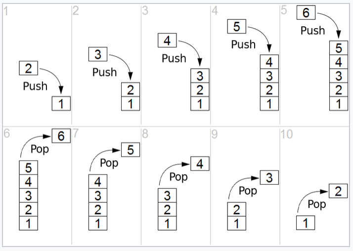

---
## Front matter
title: "Доклад по теме \"Переполнение буфера\""
subtitle: "Основы информационной безопасности"
author: "Малюга Валерия Васильевна"

## Generic otions
lang: ru-RU
toc-title: "Содержание"

## Pdf output format
toc: true # Table of contents
toc-depth: 2
lof: true # List of figures
lot: true # List of tables
fontsize: 12pt
linestretch: 1.5
papersize: a4
documentclass: scrreprt
## I18n polyglossia
polyglossia-lang:
  name: russian
  options:
	- spelling=modern
	- babelshorthands=true
polyglossia-otherlangs:
  name: english
## I18n babel
babel-lang: russian
babel-otherlangs: english
## Fonts
mainfont: PT Serif
romanfont: PT Serif
sansfont: PT Sans
monofont: PT Mono
mainfontoptions: Ligatures=TeX
romanfontoptions: Ligatures=TeX
sansfontoptions: Ligatures=TeX,Scale=MatchLowercase
monofontoptions: Scale=MatchLowercase,Scale=0.9
## Biblatex
biblatex: true
biblio-style: "gost-numeric"
biblatexoptions:
  - parentracker=true
  - backend=biber
  - hyperref=auto
  - language=auto
  - autolang=other*
  - citestyle=gost-numeric
## Pandoc-crossref LaTeX customization
figureTitle: "Рис."
tableTitle: "Таблица"
listingTitle: "Листинг"
lofTitle: "Список иллюстраций"
lotTitle: "Список таблиц"
lolTitle: "Листинги"
## Misc options
indent: true
header-includes:
  - \usepackage{indentfirst}
  - \usepackage{float} # keep figures where there are in the text
  - \floatplacement{figure}{H} # keep figures where there are in the text
---

# Введение

Переполнение буфера (англ. Buffer Overflow) — явление, возникающее, когда компьютерная программа записывает данные за пределами выделенного в памяти буфера.

Переполнение буфера (англ. Buffer Overflow) обычно возникает из-за неправильной работы с данными, полученными извне, и памятью, при отсутствии жесткой защиты со стороны подсистемы программирования (компилятор или интерпретатор) и операционной системы. В результате переполнения могут быть испорчены данные, расположенные следом за буфером (или перед ним).

Переполнение буфера является одним из наиболее популярных способов взлома компьютерных систем, так как большинство языков высокого уровня использует технологию стекового кадра — размещение данных в стеке процесса, смешивая данные программы с управляющими данными (в том числе адреса начала стекового кадра и адреса возврата из исполняемой функции).

Переполнение буфера может вызывать аварийное завершение или зависание программы, ведущее к отказу обслуживания (denial of service, DoS). Отдельные виды переполнений, например переполнение в стековом кадре, позволяют злоумышленнику загрузить и выполнить произвольный машинный код от имени программы и с правами учетной записи, от которой она выполняется.

# Актуальность темы

Несмотря на развитие защитных технологий, переполнение буфера продолжает использоваться в атаках, особенно на программное обеспечение, написанное на языках без встроенной защиты памяти, таких как C или C++. Эта уязвимость остаётся одним из ключевых векторов атак при эксплуатации приложений.

# Объект и предмет исследования

Объект исследования: Программное обеспечение, подверженное переполнению буфера.Предмет исследования: Механизмы возникновения, эксплуатации и предотвращения переполнения буфера.

# Цель и задачи исследования

Цель: Изучить природу переполнения буфера и методы его предотвращения.

Задачи:

1. Рассмотреть теоретическую базу и структуру памяти, связанную с переполнением буфера.

2. Проанализировать стек и его роль в исполнении функций.

3. Показать механизм переполнения и его последствия.

4. Продемонстрировать практическую эксплуатацию.

# Материалы и методы

В исследовании использованы методы статического анализа, моделирования переполнения в условиях контролируемой среды, а также практическое применение эксплойтов.

# Теоретическое введение


Программа, которая использует уязвимость для разрушения защиты другой программы, называется эксплойтом. Наибольшую опасность представляют эксплойты, предназначенные для получения доступа к уровню суперпользователя или, другими словами, повышения привилегий. Эксплойт переполнения буфера достигает этого путём передачи программе специально изготовленных входных данных. Такие данные переполняют выделенный буфер и изменяют данные, которые следуют за этим буфером в памяти.

Представим гипотетическую программу системного администрирования, которая исполняется с привилегиями суперпользователя — к примеру, изменение паролей пользователей. Если программа не проверяет длину введённого нового пароля, то любые данные, длина которых превышает размер выделенного для их хранения буфера, будут просто записаны поверх того, что находилось после буфера. Злоумышленник может вставить в эту область памяти инструкции на машинном языке, например, шелл-код, выполняющие любые действия с привилегиями суперпользователя — добавление и удаление учётных записей пользователей, изменение паролей, изменение или удаление файлов и т. д. Если исполнение в этой области памяти разрешено и в дальнейшем программа передаст в неё управление, система исполнит находящийся там машинный код злоумышленника.

Правильно написанные программы должны проверять длину входных данных, чтобы убедиться, что они не больше, чем выделенный буфер данных. Однако программисты часто забывают об этом. В случае, если буфер расположен в стеке и стек «растёт вниз» (например в архитектуре x86), то с помощью переполнения буфера можно изменить адрес возврата выполняемой функции, так как адрес возврата расположен после буфера, выделенного выполняемой функцией. Тем самым есть возможность выполнить произвольный участок машинного кода в адресном пространстве процесса. Использовать переполнение буфера для искажения адреса возврата возможно, даже если стек «растёт вверх» (в этом случае адрес возврата обычно находится перед буфером).

Переполнения буфера широко распространены в программах, написанных на относительно низкоуровневых языках программирования, таких как язык ассемблера, Си и C++, которые требуют от программиста самостоятельного управления размером выделяемой памяти. Устранение ошибок переполнения буфера до сих пор является слабо автоматизированным процессом.


## Выделение памяти
Чтобы понять механизм возникновения переполнения буфера, нужно немного разобраться с выделением памяти в программы. В написанном на языке С приложении можно выделить память в стеке во время компиляции или в куче во время выполнения.

Объявление переменной в стеке: int numberPoints = 10.
Объявление переменной в куче: int* ptr = malloc (10 * sizeof(int)).
Переполнение буфера может происходить в стеке (переполнение стека) или в куче (переполнение кучи). Как правило, переполнение стека встречается чаще. Он содержит последовательность вложенных функций: каждая из них возвращает адрес вызывающей функции, к которой нужно вернуться после завершения работы. Этот возвращаемый адрес может быть заменен инструкцией для выполнения фрагмента вредоносного кода.

Поскольку куча реже хранит возвращаемые адреса, гораздо сложнее (хотя в ряде случаев это возможно) запустить эксплойт. Память в куче обычно содержит данные программы и динамически выделяется по мере ее выполнения. Это означает, что при переполнении кучи, скорее всего, перезапишется указатель функции – такой путь более сложен и менее эффективен чем переполнение стека.

Поскольку переполнение стека является наиболее часто используемым типом переполнения буфера, кратко рассмотрим, как именно они работают.

## Как работает стек

Эксплуатация уязвимости происходит внутри процесса, при этом каждый процесс имеет свой собственный стек. Когда он выполняет основную функцию, то находит как новые локальные переменные (которые будут «запушены» в начало стека), так и вызовы других функций (которые создадут новый «стекфрейм»).(рис. 1).

{#fig:001 width=70%}


 Стек — это область памяти, используемая для хранения аргументов, переменных и адресов возврата функций. Он работает по принципу LIFO (последний пришёл — первым вышел) и растёт от высоких адресов к низким. Важнейшие регистры:

	ESP (Extended Stack Pointer) — указывает на последний помещенный в стек элемент.

	EBP (Extended Base Pointer) — указывает на основание текущего кадра стека. Он остается постоянным до тех пор, пока программа выполняет текущий стекфрейм.

	EIP (Extended Instruction Pointer) — содержит адрес следующей инструкции, которую должен выполнить процессор.  


Стек вызовов – это в основном код ассемблера для конкретной программы. Это стек переменных и стекфреймов, которые сообщают компьютеру, в каком порядке выполнять инструкции. Для каждой функции, которая еще не завершила выполнение, будет создан стекфрейм, а функция, которая выполняется в данный момент, будет находиться в верхней части стека.

## Пример уязвимости переполнения буфера

```
int main() {
    bufferOverflow();
}

void bufferOverflow() {
    char textLine[10];
    printf("Enter your line of text: ");
    gets(textLine);
    printf("You entered: %s", textLine);
}
В приведённом примере используется небезопасная функция gets(), которая не ограничивает количество считываемых символов. Буфер textLine рассчитан на 10 символов, включая нулевой завершающий символ (\0). Однако gets() будет читать данные до появления символа новой строки или конца файла, не проверяя, влезают ли они в выделенную память.

Потенциальная угроза
Если ввести строку длиной более 9 символов, данные начнут записываться за пределами буфера, в соседние области стека. Это может привести к:

Перезаписи других локальных переменных.

Повреждению указателя возврата функции, что позволяет выполнить произвольный код.

Нарушению целостности программы и, в худшем случае, — к выполнению кода злоумышленника.

Безопасная альтернатива

```

void bufferSafe() {
    char textLine[10];
    printf("Enter your line of text: ");
    fgets(textLine, sizeof(textLine), stdin);
    printf("You entered: %s", textLine);
}

int main() {
    bufferSafe();
    return 0;
}
```
Функция fgets() считывает ограниченное количество символов и автоматически завершает строку, не допуская выхода за границы буфера. Такой подход помогает защититься от переполнения и обеспечивает корректную работу программы.


## Введение в эксплуатацию уязвимостей (Exploit Development)

Эксплуатация переполнения буфера — это процесс создания специальных данных (payload), которые используют уязвимость для изменения поведения программы. Среди основных техник:

- **Shellcode** — небольшой код на машинном языке, который выполняет действия, желаемые злоумышленником (например, открывает командную оболочку). Shellcode внедряется в память и запускается через переполнение.

- **ROP-цепочки (Return-Oriented Programming)** — техника, которая используется, когда прямая вставка и выполнение shellcode запрещена (например, включена DEP). ROP использует фрагменты существующего кода программы (гаджеты), комбинируя их для выполнения вредоносных действий без внедрения нового кода.

Эти методы требуют глубокого понимания архитектуры процессора, структуры памяти и особенностей исполняемого кода. Современные защитные механизмы значительно усложняют разработку успешных эксплойтов, однако они по-прежнему остаются актуальной проблемой безопасности.


## Способы предотвращения

Для предотвращения **переполнения буфера (buffer overflow)** рекомендуется использовать комплексный подход, включающий как меры на уровне программного кода, так и механизмы защиты операционной системы:

### 1. Контроль границ буфера
- Следует проверять размер входных данных перед записью в буфер.  
- Желательно избегать работы с памятью без явной валидации длины строк и массивов.  
- Рекомендуется использовать условия и циклы, исключающие выход за допустимые границы.

### 2. Использование безопасных функций
- Предпочтение следует отдавать безопасным альтернативам:  
  – `strncpy` вместо `strcpy`,  
  – `snprintf` вместо `sprintf`,  
  – `memcpy_s` вместо `memcpy`.  
- Следует применять функции, принимающие аргумент длины и предотвращающие выход за пределы буфера.

### 3. Обновление программного обеспечения
- Необходимо регулярно устанавливать обновления операционной системы, библиотек и приложений.  
- Патчи безопасности следует применять сразу после их выпуска.  
- В случае возможности рекомендуется использовать автоматическое обновление.

### 4. Защита на уровне операционной системы
- Применяется **ASLR (Address Space Layout Randomization)** — рандомизация расположения памяти для затруднения атак.  
- Используется **DEP/NX-bit (Data Execution Prevention)** — предотвращение выполнения кода в сегментах данных.  
- Реализуются **stack canaries** — специальные значения в стеке для выявления попыток переполнения.  
- При компиляции включаются защитные флаги, такие как `-fstack-protector`.

### 5. Анализ и тестирование
- Рекомендуется использовать статический и динамический анализ для выявления уязвимостей.  
- Применяется **fuzzing** — автоматическое тестирование с помощью случайного ввода.  
- Периодически проводится аудит безопасности и ревизия кода.

### 6. Ограничение прав и изоляция
- Программы запускаются с минимально необходимыми правами.  
- Для повышения безопасности используются механизмы контейнеризации и песочницы (sandbox).


# Список литературы. Библиография

[0] Методические материалы курса

[1] https://www.freecodecamp.org/news/buffer-overflow-attacks/

[2] https://www.eecis.udel.edu/~cshen/367/notes/Buffer%20Overflow.pdf

[3] www.corelan.be/index.php/2009/07/19/exploit-writing-tutorial-part-1-stack-based-overflows/
