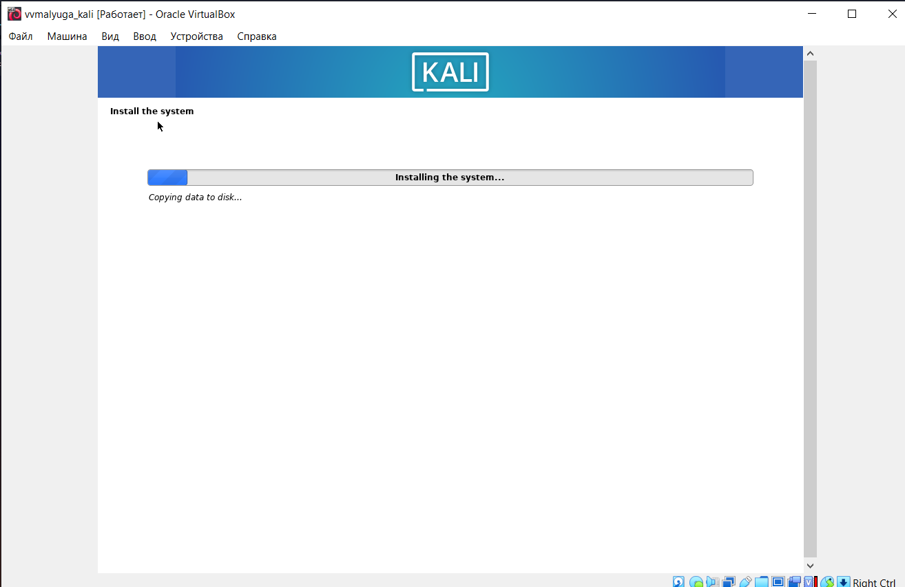
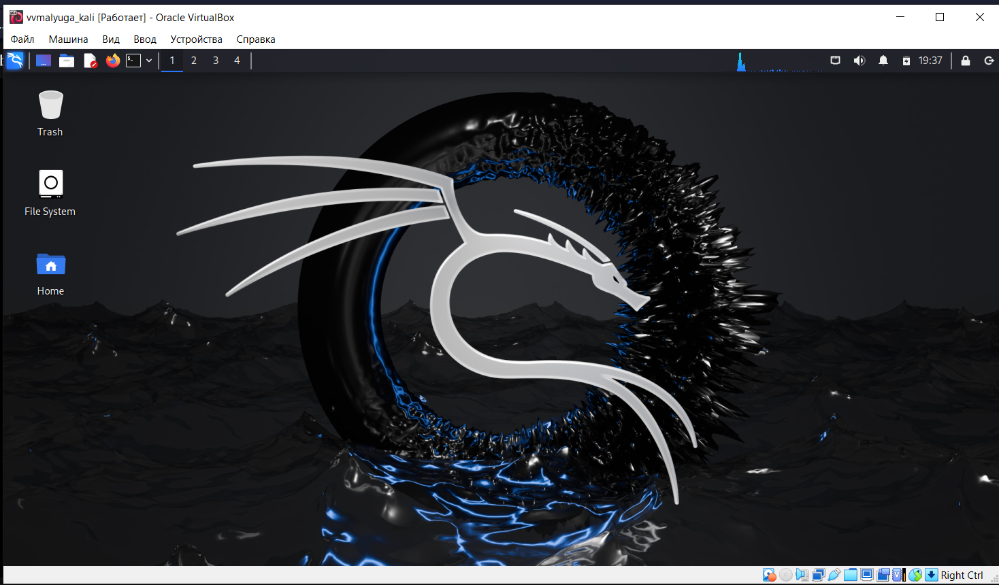

---
## Front matter
lang: ru-RU
title: Презентация по выполнению индивидуального проекта №1
subtitle: Основы информационной безопасности
author:
  - Малюга В. В.
institute:
  - Российский университет дружбы народов, Москва, Россия
date: 7 марта 2024

## i18n babel
babel-lang: russian
babel-otherlangs: english

## Formatting pdf
toc: false
toc-title: Содержание
slide_level: 2
aspectratio: 169
section-titles: true
theme: metropolis
header-includes:
 - \metroset{progressbar=frametitle,sectionpage=progressbar,numbering=fraction}
---

# Информация

## Докладчик

:::::::::::::: {.columns align=center}
::: {.column width="70%"}

  * Малюга Валерия Васильевна
  * студентка группы НКАбд-04-23
  * Российский университет дружбы народов
  * <https://github.com/vvmalyuga>

:::
::: {.column width="30%"}

:::
::::::::::::::

## Цель работы

Целью данной работы является приобретение практических навыков установки операционной системы на виртуальную машину, настройки минимально необходимых для дальнейшей работы сервисов.   

Научиться основным способам тестирования веб приложений.

# Задание
 
1. Установить дистрибутив Kali Linux в виртуальную машину.

# Выполнение первого этапа проекта

## Создание виртуальной машины 

Создала виртуальную машину согласно требованиям (рис. [fig:001]).

{#fig:001 width=70%}
## Создание виртуальной машины 

Создала виртуальную машину согласно требованиям (рис. [fig:002]).

{#fig:002 width=70%}

## Создание виртуальной машины 

Создала виртуальную машину согласно требованиям (рис. [fig:003]).

{#fig:003 width=70%}

## Создание виртуальной машины 

Создала виртуальную машину согласно требованиям (рис. [fig:004]).

{#fig:004 width=70%}

## Установка Kali Linux 

Установила Kali Linux (рис. [fig:005]).

{#fig:005 width=70%}

## Вход в систему

Вход в систему выполнен успешно, как и ее загрузка 

{#fig:006 width=70%}

## Вывод

Приобрела практические навыки по установке операционной системы Linux на виртуальную машину. Установила дистрибутив Kali LInux на VirtualBox.

